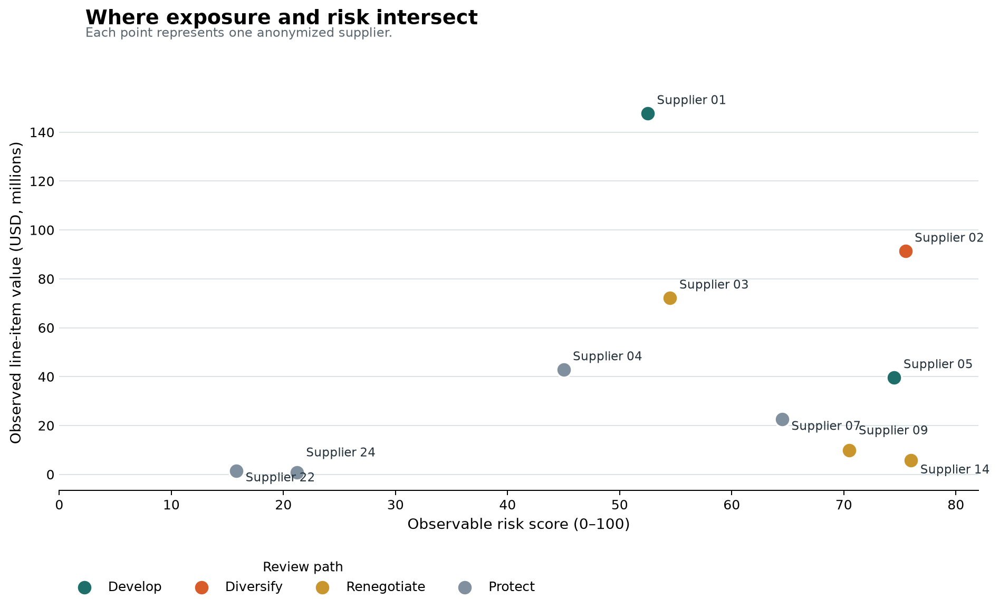

# Procurement Spend & Supplier Risk Intelligence

**Which supplier relationships deserve management attention first?**

*Historical USAID SCMS shipment & pricing data | 2006-2015*

**$434M** observed value across eligible suppliers &nbsp;·&nbsp; **10** suppliers with sufficient evidence &nbsp;·&nbsp; **6** flagged for management review

## Decision

Procurement attention should concentrate on a small number of financially material relationships where observable delivery, dependency or commercial signals warrant further review. High observed value by itself is not treated as risk.



## Three highest-priority relationships

### 01 - Diversification review

**Supplier 02 | $91.4M observed exposure**

**Why it matters.** High observable risk coincides with material financial exposure.

**Management question.** Can dependency be reduced without compromising continuity?

### 02 - Performance development

**Supplier 01 | $147.7M observed exposure**

**Why it matters.** A material relationship shows a schedule-adherence signal that merits performance review.

**Management question.** Which delivery or planning issues are controllable with supplier and logistics owners?

### 03 - Commercial review

**Supplier 03 | $72.2M observed exposure**

**Why it matters.** Comparable cohorts identify a commercial review signal at material observed value.

**Management question.** Does the commercial context validate a negotiation or specification review?

## Portfolio view

| Review path | Suppliers | Observed line-item value |
|---|---:|---:|
| Develop | 2 | $187.4M |
| Diversify | 1 | $91.4M |
| Renegotiate | 3 | $87.9M |
| Protect | 4 | $67.7M |

Six suppliers are flagged for management review. The three relationships above are the highest observed exposure in the Develop, Diversify and Renegotiate paths. The labels are management-review hypotheses, not supplier-switch instructions, and they do not claim savings.

## How the decision was reached

The notebooks contain the analysis; SQL files expose the principal metric logic; `src/` holds small reusable functions.

1. **Field audit:** source grain, missingness, identifiers, dates and supplier coverage.
2. **Portfolio structure:** observed line-item value and item-level supplier dependency.
3. **Observable risk:** schedule-adherence proxy, conditional commercial variance and product dependency. Financial exposure is excluded from the risk score.
4. **Review path:** evidence gates map eligible suppliers to a management-review path.

[Start with the field audit](notebooks/01_data_quality_and_sql_validation.ipynb) or inspect the [methodology](docs/methodology.md), [SQL](sql/) and [tests](tests/).

## Interactive review dashboard

The [interactive review dashboard](https://derinyuzuak.github.io/procurement-supplier-risk-intelligence/) runs entirely in the browser from anonymized derived results. Select a supplier to inspect observed value, risk components, dependency, commercial evidence and the associated management-review hypothesis.

```powershell
python -m http.server 8765
# Open http://127.0.0.1:8765/dashboard/
```

## What the data does not tell us

Quality, compliance, contract terms and supplier capacity are not observed in this extract. Schedule results are a shipment-level proxy, not a supplier lead-time or SLA claim. Commercial variance is a screening signal, never a savings estimate. Validate supplier identity and operational context before any intervention.

## Reproduce

```powershell
python -m venv .venv
.\.venv\Scripts\Activate.ps1
pip install -r requirements.txt
python scripts/download_scms.py
python scripts/run_analysis.py
python scripts/build_notebooks.py
python scripts/build_supplier_exposure_visual.py
python scripts/build_dashboard_data.py
```

Raw data is downloaded into `data/private/` and is ignored by Git. Published outputs use anonymized supplier labels. The source data is not redistributed; details are in [`docs/data_contract.md`](docs/data_contract.md).

## Source and license

USAID *Supply Chain Shipment Pricing Data*, catalog identifier `a3rc-nmf6`, via the [AmeriGEOSS catalog record](https://data.amerigeoss.org/dataset/supply-chain-shipment-pricing-data). The MIT license applies only to this repository's code and original documentation. It does not grant rights to the source data, which is excluded and subject to the separate conditions described in the [data contract](docs/data_contract.md).

